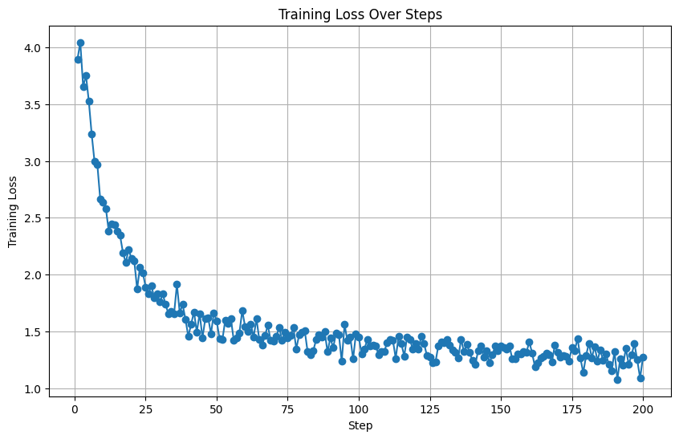

<<<<<<< HEAD
# Arbitrariness-of-Proportionality

## Project Overview

This project is designed to evaluate large amounts of European Court of Human Rights (ECHR) court rulings by analyzing the vote ratios between judges and other metadata using text mining techniques. Additionally, the provided scripts can be used to train the Llama3 language model using LoRA and Unsloth to determine whether the proportionality principle *strictu sensu* was applied in particular court rulings, and then visualize the findings.

## Table of Contents

- [Installation](#installation)
- [Usage](#usage)
  - [Evaluating Vote Ratios and Metadata](#evaluating-vote-ratios-and-metadata)
  - [Training the Model](#training-the-model)
  - [Visualizing the Findings](#visualizing-the-findings)
- [Contributing](#contributing)
- [License](#license)
- [Repository](#repository)
- [Data](#data)
- [Visualizations](#visualizations)
- [Willkür Durch Abwägung?](#scientific-paper)

## Installation

1. Clone the repository:
    ```bash
    git clone https://github.com/ByronMeissner/Arbitrariness-of-Proportionality.git
    cd Arbitrariness-of-Proportionality
    ```

2. Create a virtual environment:
    ```bash
    python3 -m venv venv
    source venv/bin/activate  # On Windows use `venv\Scripts\activate`
    ```

3. Install the required dependencies:
    ```bash
    pip install -r requirements.txt
    ```

### Identifying and Listing Dependencies

To create an exhaustive list of project dependencies, follow these steps:

#### 1. Manual Review

- Look through your codebase and note down all imported libraries.

#### 2. Using Automated Tools

- **pip freeze**: This command outputs installed packages in the environment to a `requirements.txt` file.
    ```bash
    pip freeze > requirements.txt
    ```

- **pipreqs**: Generates `requirements.txt` based on imports in your project.
    ```bash
    pip install pipreqs
    pipreqs /path/to/your/project
    ```

#### 3. Verify in a Clean Environment

Test your `requirements.txt` by setting up your project in a clean environment:
    ```bash
    python3 -m venv test_env
    source test_env/bin/activate  # On Windows use `test_env\Scripts\activate`
    pip install -r requirements.txt
    ```

## Usage

### Evaluating Vote Ratios and Metadata

1. Prepare your dataset of ECHR court rulings in a text file format.
2. Run the script to analyze the vote ratios and other metadata:
    ```bash
    python Phrasengold.py --input your_dataset.txt --output analysis_results.csv
    ```
   This will generate a CSV file with the vote ratios between judges and other relevant metadata.

### Training the Model

1. Ensure you have the Llama3 model, LoRA, and Unsloth installed and properly configured.
2. Prepare your training data from the previous step.
3. Train the model using the provided notebook and associated scripts:
    ```bash
    jupyter notebook Llamadompteur.py
    ```
   The `Llamadompteur.py` notebook utilizes the following scripts:
   - `LoadModel.py`: For loading the Llama3 model.
   - `DataPrepLabel.py`: For preparing labeled data.
   - `DataPrepTxt.py`: For preparing textual data.
   - `Trainer.py`: For training the model.
   - `Inference.py`: For running inferences using the trained model.

   Follow the instructions in the notebook to train the Llama3 model using the LoRA and Unsloth libraries.

   The model used is available on Huggingface: [ProfessorEich](https://huggingface.co/ProfessorEich).

### Visualizing the Findings

1. Use the trained model to analyze new court rulings:
    ```bash
    python AnalyzeProportionality.py --model trained_model --input new_rulings.txt --output proportionality_results.csv
    ```
2. Visualize the findings using the visualization scripts:
    ```bash
    python Countries.py --input proportionality_results.csv --output images/countries_visualization.png
    python DissentingOpinion.py --input proportionality_results.csv --output images/dissenting_opinion_visualization.png
    python VoteRatios.py --input proportionality_results.csv --output images/vote_ratios_visualization.png
    ```
   These scripts will generate visual representations of the analysis results.

## Contributing

We welcome contributions to this project. To contribute, please follow these steps:

1. Fork the repository.
2. Create a new branch (`git checkout -b feature-branch`).
3. Make your changes and commit them (`git commit -m 'Add some feature'`).
4. Push to the branch (`git push origin feature-branch`).
5. Open a pull request.

Please ensure your code follows our coding standards and is well-documented.

## License

This project is licensed under the MIT License. See the [LICENSE](LICENSE) file for details.

## Repository

For more information, visit our GitHub repository: [Arbitrariness-of-Proportionality](https://github.com/ByronMeissner/Arbitrariness-of-Proportionality)

## Data

This project includes a comprehensive dataset containing approximately 16,000 ECHR court rulings. Additionally, there is a labeled control set with both rulings that apply the principle of proportionality and those that do not. This data is critical for training and evaluating the models used in this project. The necessary web scraping tool was provided by the [ECHR-OD_process](https://github.com/echr-od/ECHR-OD_process) repository. Annotated data used to train the model was taken from the [mining-legal-arguments](https://github.com/trusthlt/mining-legal-arguments) repository.

## Visualizations

### Project Workflow


1. **Data Ingestion**: Gather ECHR court rulings data.
2. **Text Mining**: Analyze vote ratios and other metadata using `Phrasengold.py`.
3. **Model Training**: Train the Llama3 model using LoRA and Unsloth with scripts from `Llamadompteur.py`.
4. **Inference and Visualization**: Apply the trained model to new data and visualize the results.

### Model Training Progress


*Figure 3: Training Loss Over Epochs*

### Visualization of Findings


*Figure 5: Number of Cases in Front of ECHR by Country*


*Figure 6: Ratio of Judgments with Dissenting Decisions to Judgments with Uniform Decisions*


*Figure 7: Distribution of Judges Vote Ratios Depending on Proportionality Principle Application*

## Scientific Paper

This repository was created in conjunction with the scientific paper titled "Willkür durch Abwägung? Der Grundsatz der Verhältnismäßigkeit als Instrument rechtlicher Beliebigkeit?" For more information, refer to the paper for detailed insights and findings.
